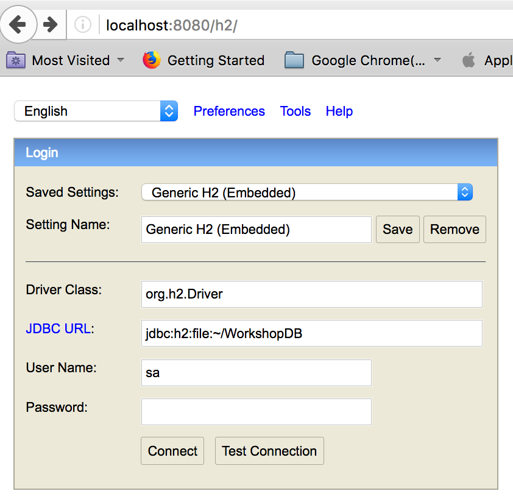

# 2018 APJC Tech Summit in Macau - Java microservice migration 

<hr>

# Table of Contents
1. [Overview of This Workshop](#Overview-of-This-Workshop)  
1.1 [Basic Steps of Migration](#Basic-Steps-of-Migration)  
1.2 [Practical Steps for Java application migration](#Practical-Steps-for-Java-application-migration)
2. [Preparation](#Preparation)  
2.1 [Full installation(Recommeded)](#Full-installation)  
2.2 [Using AMI](#Use-an-AMI)
3. [Labs : Migration from Monolithic to Microservice](#Labs-:-Migration-from-Monolithic-to-Microservice)  
3.1 [Workshop Steps](#Workshop-Steps)  
3.2 [Lab-1](#Lab-1)  
3.3 [Lab-2](#Lab-2)  
3.4 [Lab-3](#Lab-3)  
3.5 [Lab-4](#Lab-4)  
3.6 [Lab-5](#Lab-5)


# Overview of This Workshop

- This workshop introduce the fundamental concenpt and steps for the migration from Java Monolithic application to microservices on AWS environment.
- The simple platform or code changing is not able to fullfill the requirement of migration to the microservies


## Basic Steps of Migration
1. Identify Domains and data (Domain Decomposition)
2. Migrate database (Splitting data/ database refactoring)    
3. Select best platform for microservices  
4. Change your application

## Practical Steps for Java application migration
1. Create a HTTP endpoints
2. Externalize Configuration
3. Expose Application Metrics and Information
4. Calling Another Service
5. Deploy Microservices at Scale with Docker and ECS/EKS
6. Cluster Management  
Service Discovery  
Failure Mangement : Cluster self healing  
Circuit Breaker pattern  
Load Balancing
7. Logging, Tracing, Metric Monitoring, CI/CD, Configuraiton management


# Preparation

## Full installation
The minimal tools required in this workshop is as follows
Eclipse IDE is optional as your dev IDE for studying this workshop but not mandatory

### Install all required SDK and tools

**Mandatory**  
1. Java SDK 8 or above  
2. Git client, 
3. Maven (3.5.3)
4. AWS CLI : https://docs.aws.amazon.com/cli/latest/userguide/installing.html
5. Docker 

**Optional**  
- Eclipse Oxygen 3 or above
- AWS plugin for Eclipse  : https://docs.aws.amazon.com/toolkit-for-eclipse/v1/user-guide/setup-install.html


## Use an AMI


# Labs : Migration from Monolithic to Microservice

## Workshop Steps

1. Lab-1 : Create a HTTP endpotins 
2. Lab-2 : Externalize Configuration / Expose Application Metrics and information
3. Lab-3 : Splitting projects 
4. Lab-4 : Create a docker image and push it to ECR
5. Lab-5 : Create a ECR
6. Lab-6 : Logging and Service Discovery (optional)


## Lab-1

### Table of Contents
1. [First application](#First-application)  
1.1 [Download codes](#Download-codes)  
1.2 [Compile and package](#Compile-and-package)  
1.3 [Run your application](#Run-your-application)  
2. [Test the application](#Test-the-application)  
2.1 [Check HTTP endpoints for USER data with CURL](#Check-HTTP-endpoints-for-USER-data-with-CURL)  
2.2 [Check HTTP endpoints for IMAGE data with CURL](#Check-HTTP-endpoints-for-IMAGE-data-with-CURL)  
2.3 [Check the web pages](#Check-the-web-pages)
3. [Change Properties(optional)](#Change-Properties(optional))  
3.1 [Change H2 password](#Change-H2-password)  
3.2 [Change application.properties](#Change-application.properties)

### First application

#### Download codes

```
git clone https://github.com/aws-asean-builders/APJC-TechSummit-2018-java-microservice-workshop.git
```

#### Compile and package

1. Change working directory to module-01
	
```
cd <work_space>/module-01
```

2. Compile and package without unit testing(recommended)

```
mvn compile package -Dmaven.test.skip=true

```
	
#### Run your application 
	
```
java -jar target/module-01-0.1.0.jar
```

### Test the application
Run MainControllerTest with JUnit Runner and check the console output and it's result. if you get a error messages then take a look at how to fix the problem.
We have 2 kinds of unit test, one is mock test, the other is integration test, please check 2 files in test folder.


#### Check HTTP endpoints for USER data with CURL 
Launch your application in your Eclipse IDE and run 'curl' command like below

```
# test user
curl 'localhost:8080/workshop/users/all'

curl 'localhost:8080/workshop/users/add?name=First&email=ex1@gmail.com'

curl 'localhost:8080/workshop/users/deleteall'

curl 'localhost:8080/workshop/users/all'
```

#### Check HTTP endpoints for IMAGE data with CURL 
```
curl 'localhost:8080/workshop/images/all'

curl 'localhost:8080/workshop/images/add?userid=1&bucket=seon-singapore&prefix=/output&filename=test.PNG'

curl 'localhost:8080/workshop/images/deleteall'

curl 'localhost:8080/workshop/images/all'

```

#### Check the web pages
Open *localhost:8080/index.html*  
Run CRUD for User data  
Check user list, add/update/delete user

Open *localhost:8080/users/add*, *localhost:8080/users*


### Change Properties(optional)
#### Change H2 password
**If you have enough time, Procced this section, if not, skip this section.**

Currently we are using H2 database. If you want to change this database to MySQL in local then, please see application.properties.

1. Connect H2 console (http://localhost:8080/h2)
2. Specify JDBC URL "jdbc:h2:file:~/WorkshopDB"
3. User Name : **sa**
4. Password : *none*



5. Change password to "12345678"

```
ALTER USER sa SET PASSWORD '12345678';
```

#### Change application.properties

Please see application.properties in **moudle-01/src/main/resources**

1. Specify password value

``` 
spring.datasource.password=12345678
```
2. Re-launch application

```
mvn compile package -Dmaven.test.skip=true

java -jar target/module-01-0.1.0.jar

```


## Lab-2

## Lab-3

## Lab-4

## Lab-5