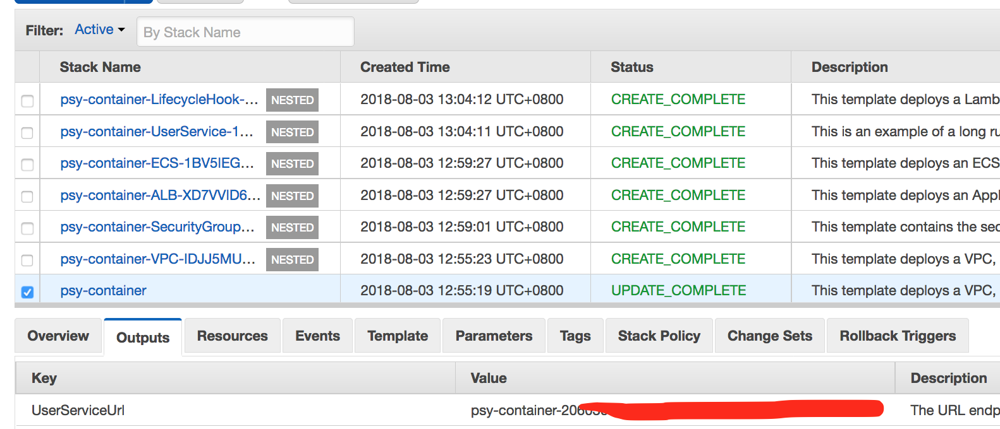

# 2018 APJC Tech Summit in Macau - Java microservice migration 


### Welcome

This contents covers fundamental steps of migration from monolithic to microservices for Java application.

### Presenter

- Seon Yong Park (Developer Specialist SA)


### Lab Instructors

Thanks to the following people for their assistance with this lab:

- Richard Yeo (Solutions Architect)
- Kelvin Kok (Solutions Architect)
- Wei Shen Toh (Solutions Architect)
- Jong Min Moon (Solutions Architect)
- Sungmin Hong (Technical Trainer)


<hr>

# Table of Contents
1. [Overview of This Workshop](#Overview-of-This-Workshop)  
1.1 [Basic Steps of Migration](#Basic-Steps-of-Migration)  
1.2 [Practical Steps for Java application migration](#Practical-Steps-for-Java-application-migration)
2. [Preparation](#Preparation)  
2.1 [Full installation(Recommeded)](#Full-installation)  
2.2 [Using AMI](#Use-an-AMI)
3. [Labs : Migration from Monolithic to Microservice](#Labs-:-Migration-from-Monolithic-to-Microservice)  
3.1 [Workshop Steps](#Workshop-Steps)  
3.2 [Lab-1](#Lab-1)  
3.3 [Lab-2](#Lab-2)  
3.4 [Lab-3](#Lab-3)  
3.5 [Lab-4](#Lab-4)  
3.6 [Lab-5](#Lab-5)  
3.7 [Lab-6 (Optional)](#Lab-6-(Optional))


# Overview of This Workshop

- This workshop introduce the fundamental concenpt and steps for the migration from Java Monolithic application to microservices on AWS environment.
- The simple platform or code changing is not able to fullfill the requirement of migration to the microservies


## Basic Steps of Migration
1. Identify Domains and data (Domain Decomposition)
2. Migrate database (Splitting data/ database refactoring)    
3. Select best platform for microservices  
4. Change your application

## Practical Steps for Java application migration
1. Create a HTTP endpoints
2. Externalize Configuration
3. Expose Application Metrics and Information
4. Deploy Microservices at Scale with Docker and ECS/EKS
5. Cluster Management  
Service Discovery  
Failure Mangement, Circuit Breaker pattern, Load Balancing

6. Logging, Tracing, Metric Monitoring, CI/CD, Configuraiton management


# Preparation

### Do not use VPN!!!

## Full installation
The minimal tools required in this workshop are followings.

### Install all required SDK and tools

**Mandatory**  
1. Java SDK 8 or above
2. Git client, 
3. Maven (3.5.3)
4. AWS CLI : https://docs.aws.amazon.com/cli/latest/userguide/installing.html
5. Docker : https://docs.docker.com/docker-for-mac/install/
6. MySql Client : If you have Homebrew in your Mac then,
```
brew install mysql
```
If you don't have Homebrew then,
```
/usr/bin/ruby -e "$(curl -fsSL https://raw.githubusercontent.com/Homebrew/install/master/install)"
```


## Use EC2 AMI
- If you have some problems on installing tools in your Mac, then :
1. Search **"APJC-java-microservice-migration-workshop"** AMI in Community AMIs (**Singapore region only**)
2. Select instance type "t2.large" at least. You don't need to attach a IAM role on this EC2 instance.
3. After launching an instance, configure AWS CLI with your credentials(your credential must have enough privilege). 
```
aws configure
```


# Labs : Migration from Monolithic to Microservice

## Regions
### Recommended Region 
- **ap-southeast-1** (singapore) for **Lab-1 ~ Lab-5**
- **us-east-1** (virginia) for **Lab-6**

## Workshop Steps

1. Lab-1 : Create a HTTP endpoints 
2. Lab-2 : Externalize Configuration / Expose Application Metrics and information
3. Lab-3 : Splitting projects 
4. Lab-4 : Create a docker image and push it to ECR
5. Lab-5 : Create a ECR
6. Lab-6 : Logging and Service Discovery (optional)


<hr>

## Lab-1

- This is first lab to create a Java Spring application.
- This is monolithic Restful application. It uses Spring Data and exposing Restful HTTP endpoints.

Step of migration : Create a HTTP endpotins 

### Table of Contents
1. [First application](#First-application)  
1.1 [Download codes](#Download-codes)  
1.2 [Compile and package](#Compile-and-package)  
1.3 [Run your application](#Run-your-application)  
2. [Test the application](#Test-the-application)  
2.1 [Check HTTP endpoints for USER data with CURL](#Check-HTTP-endpoints-for-USER-data-with-CURL)  
2.2 [Check HTTP endpoints for IMAGE data with CURL](#Check-HTTP-endpoints-for-IMAGE-data-with-CURL)  
2.3 [Check the web pages](#Check-the-web-pages)
3. [Change Properties(optional)](#Change-Properties(optional))  
3.1 [Change H2 password](#Change-H2-password)  
3.2 [Change application.properties](#Change-application.properties)

### First application

- We recommend using console not IDE.

#### Download codes

```
git clone https://github.com/aws-asean-builders/APJC-TechSummit-2018-java-microservice-workshop.git
```

#### Compile and package

1. Change working directory to module-01
	
```
cd <work_space>/module-01
```

2. Compile and package without unit testing(Skip testing)

```
mvn clean compile package -Dmaven.test.skip=true

```
	
#### Run your application 
	
```
java -jar target/module-01-0.1.0.jar
```

### Test the application
Run MainControllerTest with JUnit Runner and check the console output and it's result. if you get a error messages then take a look at how to fix the problem.
We have 2 kinds of unit test, one is mock test, the other is integration test, please check 2 files in test folder.


#### Check HTTP endpoints for USER data with CURL 
Launch your application in your Eclipse IDE and run 'curl' command like below

```
# test user
curl 'localhost:8080/workshop/users/all'

curl 'localhost:8080/workshop/users/add?name=First&email=ex1@gmail.com'

curl 'localhost:8080/workshop/users/deleteall'

curl 'localhost:8080/workshop/users/all'
```

#### Check HTTP endpoints for IMAGE data with CURL 
```
curl 'localhost:8080/workshop/images/all'

curl 'localhost:8080/workshop/images/add?userid=1&bucket=seon-singapore&prefix=/output&filename=test.PNG'

curl 'localhost:8080/workshop/images/deleteall'

curl 'localhost:8080/workshop/images/all'

```

#### Check HTTP endpoints for Photo data with CURL 
```
curl 'localhost:8080/workshop/photos/all'

```


#### Check the web pages
Open *localhost:8080*  

Open *localhost:8080/users/add*, *localhost:8080/users*


<hr>

## Lab-2
- We are going to add several features in the application. Module-02  already has following features
- Externalize Configuration / Expose Application Metrics and information

### Table of Contents
1. [Run application (module-02)](#Run-application-(module-02))
2. [Externalize Configuration](#Externalize-Configuration)     
2.1 [Configure AWS CLI(Optional)](#Configure-AWS-CLI(Optional))  
2.2 [Configure ParameterStore in System Manager](#Configure-ParameterStore-in-System-Manager)  
2.3 [Run your application again](#Run-your-application-again)  
3. [Expose Application Metrics and Information](#Expose-Application-Metrics-and-Information)  
3.1 [Check Application Info](#Check-Application-Info)

### Run application (module-02)

```
cd module-02
mvn clean compile package -Dmaven.test.skip=true
java -jar target/module-02-0.1.0.jar
```
 
- **You definitely got error above, it is because you don't have Parameter Stores**
- You need to perform following task.

1. Configure Your Parameter Store
2. If you are using a developing AMI, check your EC2 role.
 

### Externalize Configuration 

#### Configure AWS CLI(Optional)
If you didn't configure AWS CLI, then install or uprate your AWS CLI 
**If you configured AWS CLI configuraiton before, then skip this 1.1 

```
> aws configure
> AWS Access Key ID [None]: [your key]
> AWS Secret Access Key [None]: [your key]
> AWS region : [your region]
```

#### Configure ParameterStore in System Manager 
- AWS Systems Manager Parameter Store provides secure, hierarchical storage for configuration data management and secrets management. You can store data such as passwords, database strings, and license codes as parameter values.
Complete the following tasks to configure application parameters for ParameterStore (select your region, for example, <your-region>, ap-southeast-1 and so forth)


1. Open the System Manager Cosole and go to Parameter Store
2. Create parameters in ParameterStore for database URL, database username and password in your region
3. Specify **datasource.url** as **jdbc:h2:file:~/WorkshopDB**
4. Specify **datasource.username** as **sa**
5. Specify **datasource.password** as **12345678**


#### Run your application again

Check your Roles in Credential(or EC2 role, if you are using AMI), if you have errors after creating parameters in Parameter Store.

### Expose Application Metrics and Information
We are using "spring-boot-starter-actuator", please check application metrics and information using following command

#### Check Application Info
Actuator endpoints let you monitor and interact with your application. Spring Boot includes a number of built-in endpoints and lets you add your own. For example, the health endpoint provides basic application health information.
For example,

- beans : Displays a complete list of all the Spring beans in your application.
- conditions : Shows the conditions that were evaluated on configuration and auto-configuration classes and the reasons why they did or did not match.
- info : Displays arbitrary application info.

Each individual endpoint can be enabled or disabled. 
If you need more information, refer this : https://docs.spring.io/spring-boot/docs/current/reference/html/production-ready-endpoints.html


Http endpoints for acutuator are differnt based on spring version.


If it is Spring 1.5x,

```
curl localhost:8080/health
curl localhost:8080/beans
```

If it is Spring 2.0.x

```
curl localhost:8080/actuator/info
curl localhost:8080/actuator/health
curl localhost:8080/actuator/metrics
```

Also you need to change application.properites according to the version of Spring.

1.5x
```
#actuator for spring 1.5
endpoints.actuator.enabled=true
management.security.enabled=false
```

2.0x
```
#actuator for spring 2.x
endpoints.actuator.enabled=true
management.endpoints.web.exposure.include=*
management.endpoints.web.exposure.exclude=env
```
<hr>

## Lab-3
- Splitting projects into services

### Table of Contents
1. [Run your appplications](#Run-your-appplications)  
1.1 [Compile and run 2 applications](#Compile-and-run-2-applications)   
2. [Migrate to Mysql DB](#Migrate-to-Mysql-DB)  
2.1 [Create an Aurora MySQL instance](#Create-an-Aurora-MySQL-instance)  
2.2 [Install MySQL Client and Create a new user](#Install-MySQL-Client-and-Create-a-new-user)  
2.3 [Configure ParameterStore](#Configure-ParameterStore)  
2.4 [Run application](#Run-application)
3. [Dynamo Database table](#Dynamo-Database-table)  
3.1 [Verify Created Table](#Verify-Created-Table)  
3.2 [Run and check](#Run-and-check)

### Run your appplications

#### Compile and run 2 applications
We have 2 projects (module-03-ddb, modlue-03-mysql).
Comple and run both application

```
cd <work_space>/module-03-ddb
mvn clean compile package -Dmaven.test.skip=true
java -jar target/module-03-ddb-0.1.0.jar
```

```
cd <work_space>/module-03-mysql
mvn clean compile package -Dmaven.test.skip=true
java -jar target/module-03-mysql-0.1.0.jar
```

You wll get error messages, if you don't have MySQL.


### Migrate to Mysql DB

#### Create an Aurora MySQL instance

1. Open the Amazon RDS console : https://console.aws.amazon.com/rds/home?region=<your-region>#
2. Select Aurora for MySQL 5.7 Database engine and select the 
3. Create a DB instance configuring database name, username, password.
4. Remember your master username and password to perform next step
	


5. Create database in configuration page (for example, workshop)
	
Name your Aurora database as TSA-Workshop, and keep the rest of the values as default.
- Select db instances of your choice (e.g. db.t2.small)
- Keep the default multi-AZ
- Cluster name: TSA-Workshop-Cluster
- Database name: workshop
- Speicfy master user id and password and remember it
- Make sure that the database is publicly accessible.
- Keep everything else as default and then launch the Aurora database.
- At your left panel, click on the 'instances' menu. You should see that RDS is creating two database instances for you (one reader and writer role respectively).

6. Wait until completing the creation of Aurora for MySQL 

Endpoint looks like this - "tsa-workshop.ctdltt3xxxx.<your-region>.rds.amazonaws.com"
	
7. Check Endpoint and Security Group
	

	
8. Change Security Group configuration, if you need.
9. Check connectivity from your local computer (if you don't have any MySQL client, please install it)

#### Install MySQL Client and Create a new user

1. Install MySQL using Brew
2. Login MySQL with master id & password
```
brew install mysql

mysql -h <endpoint of your instance> -u <master username> -p
```
	
2. Create user and it's privilege using following SQL commands(use MySQL client in your computer)

```
mysql> create user 'demouser'@'%' identified by '12345678'; -- Creates the user
mysql> grant all on workshop.* to 'demouser'@'%'; -- Gives all the privileges to the new user on the newly created 
```

3. Check the tables, there is no table yet.

```
show tables;

```


#### Configure ParameterStore

AWS Systems Manager Parameter Store provides secure, hierarchical storage for configuration data management and secrets management. You can store data such as passwords, database strings, and license codes as parameter values.
Complete the following tasks to configure application parameters for ParameterStore (default region is <your-region>)

1. Open the Amazon EC2 console at https://console.aws.amazon.com/ec2/
2. Change values in ParameterStore for database URL, database username and password

- datasource.url = jdbc:mysql://<your_db_endpoint>/workshop?&useSSL=false
- datasource.username = demouser
- datasource.password = 12345678
	


3. Add datasource.url, datasource.username, datasource.password for your Aurora instance. 
4. Specify values as you configured in previous steps.


#### Run application 
1. Run Module-03-mysql.
After running, check tables of workshop database in MySQL Client

```
use workshop;

show tables;

select * from User;

```

2. Test your applicaiton
```
curl localhost:8080/workshop/users/all
```

#### if you have errors
- Check you are using VPN connection
- Check security group of RDB 

### Dynamo Database table

#### Verify Created Table
- Application (module-03-ddb) will create PhotoInfo table automatically.

- Check PhotoInfo table create by module-03-ddb application


#### Run and check
Run Module-03-ddb and check it again

```
curl localhost:8081/workshop/photos/all
```

<hr>


## Lab-4
- Create a docker image and push it to ECR
### Table of Contents
1. [Building docker](#Building-docker)  
1.1 [Install docker tools (optional)](#Install-docker-tools-(optional))   
1.2 [Create and test](#Create-and-test)  
1.3 [More commands for Debug (Optional)](#More-commands-for-Debug-(Optional))
2. [ECR](#ECR)  
2.1 [Create an ECR repository](#Create-an-ECR-repository)  
2.2 [Push your images](#Push-your-images)  
2.3 [Verify the pushed image](#Verify-the-pushed-image)


### Building docker

Reference : 
https://docs.aws.amazon.com/AmazonECS/latest/developerguide/docker-basics.html#docker-basics-create-image

#### Install docker tools 
- If you are using labtop then must install docker tools.
- Refer this page : https://docs.docker.com/docker-for-mac/install/

If you are able to use YUM, then use following command
```
sudo yum install -y docker
```

#### Create and test

1. Check a Dockerfile

Dockerfile in **module-04**

```
FROM openjdk:8-jdk-alpine
VOLUME /tmp
ARG JAR_FILE
COPY ${JAR_FILE} app.jar
ENTRYPOINT ["java","-Djava.security.egd=file:/dev/./urandom","-jar","/app.jar"]
```

2. Create a docker image
- You need to create 2 docker images for **"module-03-mysql"** and **"module-03-ddb"**
- You need to repeat these steps for module-03-ddb with the name of "photo-service-img"
- 8080 port for module-03-mysql
- 8081 port for module-03-ddb

If you want to build a docker image for the application, then copy JAR file into your working directory and run following commands.

For example, if you build a docker img of module-03-mysql. the copy module-03-mysql-0.1.0.jar into **module-04** directory.

```	
cd ../module-04
cp ../module-03-mysql/target/module-03-mysql-0.1.0.jar .

docker build -t user-service-img:latest . --build-arg JAR_FILE="module-03-mysql-0.1.0.jar"

```

3. Run docker in your local machine

Need to pass ACCESS_KEY, SECRET_KEY as environment variable when you run an applicaiton in docker.	

If you want to run it as interactive mode, use following with 8080
```
docker run -p 80:8080 \
-e AWS_ACCESS_KEY_ID='<access-key>' \
-e AWS_SECRET_ACCESS_KEY='<secret-key>' \
-e AWS_REGION='<region>' \
-it user-service-img bash 
```

If you want to run it as daemon mode (for **module-03-mysql**)
```
docker run -d -p 80:8080 -e AWS_ACCESS_KEY_ID='<access-key>' \
-e AWS_SECRET_ACCESS_KEY='<secret-key>' \
-e AWS_REGION='<region>' \
--name=user-service user-service-img

```

4. Repeat about steps for **module-03-ddb docker**.

 
```
cd ../module-04
cp ../module-03-ddb/target/module-03-ddb-0.1.0.jar .

docker build -t photo-service-img:latest . --build-arg JAR_FILE="module-03-ddb-0.1.0.jar"

```

When you run module-03-ddb docker, use 8081

```
docker run -p 80:8081 \
-e AWS_ACCESS_KEY_ID='<access-key>' \
-e AWS_SECRET_ACCESS_KEY='<secret-key>' \
-e AWS_REGION='<region>' \
-it photo-service-img bash 
```


5. Test your running docker

For user docker
```
# test user docker
curl 'localhost/workshop/users/all'
```
For photo docker (You need to stop previous docker)
```
# test photo docker
curl 'localhost/workshop/photos/all'
```

6. Check running docker and stop it
```
docker ps

docker stop <CONTAINER ID>
```

7. USE FOLLWOING COMMAND, WEHN YOU NEED IT (Don't delete your images in this step)

```
#stop all running docker
docker stop $(docker ps -a -q)

# Delete all containers
docker rm $(docker ps -a -q)

# Delete all images
docker rmi $(docker images -q)
```

### ECR

#### Create an ECR repository

- Specify your ECR repository name, for example **user-service-repo** and **photo-service-repo**
- This repo will be used in Lab-6, must remember this repo names.

1. Run a following AWS CLI command

```
aws ecr create-repository --repository-name user-service-repo	

aws ecr create-repository --repository-name photo-service-repo
	
```
2. Check response and save a repository ARN

```
{
    "repository": {
        "registryId": "<account-id>.", 
        "repositoryName": "user-service-repo", 
        "repositoryArn": "arn:aws:ecr:<your-region>:<account id>:repository/user-service-repo", 
        "createdAt": 1516947869.0, 
        "repositoryUri": "<account-id>.dkr.ecr.<your-region>.amazonaws.com/user-service-repo"
    }
}

```

3. Get Authentication

```
aws ecr get-login --no-include-email --region <your-region> | sh
```

#### Push your images

```
docker tag user-service-img:latest  <aws_account_id>.dkr.ecr.<your_region>.amazonaws.com/user-service-repo:latest 

docker push  <aws_account_id>.dkr.ecr.<your_region>.amazonaws.com/user-service-repo:latest
```


#### Verify the pushed image

1. You can describe the images in a repository using following command.

```
aws ecr describe-images --repository-name user-service-repo

```

### Repeat for photo-service
1. Repeat above steps for photo-service


<hr>

## Lab-5
- Create a ECS

- We assume there are 2 ECR repo : **user-service**, **photo-service**
<br>

- We can create ECR stack using CloudFormation and also update it
- ECS has the ability to perform rolling upgrades to your ECS services to minimize downtime during deployments. For more information, see Updating a Service.
- To update one of your services to a new version, adjust the Image parameter in the service template (in services/* to point to the new version of your container image. 
- After you've updated the template, update the deployed CloudFormation stack; CloudFormation and ECS handle the rest.

### Table of Contents
1. [Create a Stack using CloudFormation](#Create-a-Stack-using-CloudFormation)  
1.1 [Create a S3 bucket](#Create-a-S3-bucket)   
1.2 [Change a S3 paths in files](#Change-a-S3-paths-in-files)  
1.3 [Upload step-01 files](#Upload-step-01-files)  
1.4 [Check the result](#Check-the-result)
2. [Update a ECS Stack using CloudFormation](#Update-an-ECS-Stack-using-CloudFormation)  
2.1 [Add new service](#Add-new-service)  
 3. [Add New service (optional)](#Add-New-service-(optional))

### Create a Stack using CloudFormation
- We are going to use ECR image repositories created in Lab-4.
- For example, 
```
user-service-repo : <account-id>.dkr.ecr.<your-region>.amazonaws.com/user-service-repo

photo-service-repo : <account-id>.dkr.ecr.<your-region>.amazonaws.com/photo-service-repo
```

#### Create a S3 bucket
1. Create a bucket in your region.
2. Create a folder in your bucket, for example, **<your_bucket>/ecs-cfn**
3. This bucket path will be used for following tasks.
For example, if you created a bucket name "your-name-initial/ecs-cfn" then, path will be like below.
```
 https://s3-<region>.amazonaws.com/<your-name-initial>/ecs-cfn/
```

#### Change a S3 paths in files
1. Change a S3 bucket (your bucket) and Prefix(your prefix) of master.yaml in step-01 and step-02

For example, 
```
      Properties:
            TemplateURL: https://s3-<region>.amazonaws.com/<your-bucket>/<your prefix>/infrastructure/vpc.yaml
```
You should change all S3 paths in master.yaml

2. Change a image repo URL in step-01/services/user-service/service.yaml


```
TaskDefinition:
    Type: AWS::ECS::TaskDefinition
    Properties:
        Family: user-service
        ContainerDefinitions:
            - Name: user-service
                Essential: true
                Image: <your imge repo url>
                Memory: 512
        

```

#### Upload step-01 files
1. Uploda step-01 files onto your bucket folder. You'd better use drag and drop for uploading files.


#### Create a Stack using CloudFormation
1. Specify the input file URL as your master.yaml URL
2. Specify stack name, for example, 'APJC-workshop'. Do not exeed 24 characters for stack name.


#### Check the result
1. Wait for the completion of creation (it will take about 10 ~ 15mins)
2. Check the output tab in CloudFormation


3. Check the target groups in EC2 menu.
4. Check the CloudWatch logs.

### Update an ECS Stack using CloudFormation

##### Add new service
We will add one more serice, photo-service
1. Check a **step-02** Cloufformation files.
2. Check the differences with **step-01**

- Differences.

1. Added a new service in master.yml 
```
    PhotoService:
        Type: AWS::CloudFormation::Stack
        Properties:
            TemplateURL: https://s3-ap-southeast-1.amazonaws.com/seon-singapore-01/cloudformation-ecs/services/photo-service/service.yaml
            Parameters:
                VPC: !GetAtt VPC.Outputs.VPC
                Cluster: !GetAtt ECS.Outputs.Cluster
                DesiredCount: 1
                Listener: !GetAtt ALB.Outputs.Listener 
                Path: /workshop/photos*  

```

```
Outputs:

    PhotoServiceUrl: 
        Description: The URL endpoint for the product service
        Value: !Join [ "/", [ !GetAtt ALB.Outputs.LoadBalancerUrl, "workshop/photos/all" ]]

```

2. Added new service.yaml in step-02/servies/photo-service/service.yaml

#### Update the stack
1. Upload all files in step-02 into the bucket
2. Update a stack
3. Verify the changes

### Add New service (optional)
- If you have enough time, then proceed this optional tasks.
- Use UserService Task
- Create a new service with TargetGroup "workshop/images*"
- Modify CFN templates, add new service, change it, and modify master.yaml
- Or you can do Section 2 manually without using **step-02** codes.

<hr>

## Lab-6 (Optional)
- If you have enougth time, please try this lab.
- Logging, Service Discovery and so forth
- In this lab, you will use AWS ECR CLI, install it: https://docs.aws.amazon.com/AmazonECS/latest/developerguide/ECS_CLI_installation.html


### Table of Contents
1. [Configuring Logging](#Configuring-Logging)  
2. [Service Discovery](#Service-Discovery)  
2.1 [Create a service discovery](#Create-a-service-discovery)  
2.2 [Create a ECR](#Create-a-ECR)  
2.3 [Check Input files](#Check-Input-files)  
2.4 [Resolve Errors](#Resolve-Errors)
3. [Verify the service discovery](#Verify-the-service-discovery)
4. [Clean Up](#Clean-Up)

### Configuring Logging
We already have a Log group created in Lab-5
Go to CloudWatch Logs and check the log group <your-created-stack>, for example, "APJC-workshop"


### Service Discovery
- For service discovery, **<your-region>** region is recommended.

#### Create a service discovery

1. Create a private service discovery namespace named "your-name" within an existing VPC(default VPC in your region)

- dns-name : specify your name (eg: APJC-migration-workshop)
- vpc : the vpc you want to use for ECS fargate
- region : <your-region>, us-east-2 (regions that Fargate available)

```
aws servicediscovery create-private-dns-namespace --name APJC-migration-workshop --vpc vpc-07aaaaaa --region <your-region>
```
Output :
```
{
    "OperationId": "vfwy4cf7ghe43zxxxxxxxxxxx-jkhsa0fm"
}
```

2. Using the OperationId from the previous output, verify that the private namespace was created successfully. Copy the namespace ID as it is used in subsequent commands. 

```
aws servicediscovery get-operation --operation-id vfwy4cf7ghe43zxxxxxxxxxxx-jkhsa0fm
```

Output:
```
{
    "Operation": {
        "Id": "vfwy4cf7ghe43zxxxxxxxxxxx-jkhsa0fm",
        "Type": "CREATE_NAMESPACE",
        "Status": "SUCCESS",
        "CreateDate": 15335xxxx.906,
        "UpdateDate": 15335xxxx.7,
        "Targets": {
            "NAMESPACE": "ns-myjesubutlfxxxxx"
        }
    }
}
```

3. Using the NAMESPACE ID from the previous output, create a service discovery service named myapplication. Copy the service discovery service ID as it is used in subsequent commands. 

```
aws servicediscovery create-service --name APJC-my-application --dns-config 'NamespaceId="ns-myjesubutlfxxxxx",DnsRecords=[{Type="A",TTL="300"}]' --health-check-custom-config FailureThreshold=1 --region <your-region>
```
Output:
```
{
    "Service": {
        "Id": "srv-pdd65idsnhjxxxx",
        "Arn": "arn:aws:servicediscovery:<your-region>:<user-id>:service/srv-pdd65idsnhjxxxx",
        "Name": "APJC-my-application",
        "DnsConfig": {
            "NamespaceId": "ns-myjesubutlfxxxxx",
            "RoutingPolicy": "MULTIVALUE",
            "DnsRecords": [
                {
                    "Type": "A",
                    "TTL": 300
                }
            ]
        },
        "HealthCheckCustomConfig": {
            "FailureThreshold": 1
        },
        "CreatorRequestId": "ece2037c-2e6e-4d7d-8a24-xxxxxxxxxxx"
    }
}
```

#### Create a ECR

1. Create an ECS cluster named **APJC-tech-2018-migration** to use. 
```
aws ecs create-cluster --cluster-name APJC-tech-2018-migration --region <your-region>
```

Output:

```
{
    "cluster": {
        "clusterArn": "arn:aws:ecs:<your-region>:<user-id>:cluster/APJC-tech-2018-migration",
        "clusterName": "APJC-tech-2018-migration",
        "status": "ACTIVE",
        "registeredContainerInstancesCount": 0,
        "runningTasksCount": 0,
        "pendingTasksCount": 0,
        "activeServicesCount": 0,
        "statistics": []
    }
}
```

2. Register a Task Definition

```
aws ecs register-task-definition --cli-input-json file://photo-fargate-task.json --region <your-region>
```

3. Create a Service
```
aws ecs create-service --cli-input-json file://photo-fargate-service.json --region us-east-2
```
#### Check Input files
1. **photo-fargate-task.json
- For fargate, should use "networkMode": "awsvpc"
- should be "containerPort": 80,

2. **photo-fargate-service.json**
- Must have a Subnet and SecurityGroup in same VPC you created in previous step


#### Resolve Errors

1. If you get such like a error message

```
An error occurred (ClientException) when calling the RegisterTaskDefinition operation: Fargate requires task definition to have execution role ARN to support log driver awslogs.
```
**Solution** : It means that needs a Role ARN, create a role ARN for fargate (like EC2 Instannce Role for EC2 cluster)


2. If you get such like a error message
```
An error occurred (ClientException) when calling the RegisterTaskDefinition operation: No Fargate configuration exists for given values.

```
**Solution**It might CPU or Memory size is not proper/too big, change Cpu or Memory size


### Verify the service discovery

1. List instances
```
aws servicediscovery list-instances --service-id srv-pdd65idsnhjxxxx --region <your-region>
```

2. Get information about the namespace

```

aws servicediscovery get-namespace --id ns-myjesubutlfxxxxx --region <your-region>
```
Output:
```
{
    "Namespace": {
        "Id": "ns-myjesubutlfxwgij",
        "Arn": "arn:aws:servicediscovery:<your-region>:<user-id>:namespace/ns-myjesubutlfxxxxx",
        "Name": "APJC-migration-workshop",
        "Type": "DNS_PRIVATE",
        "Properties": {
            "DnsProperties": {
                "HostedZoneId": "Z49HTDOV4DS44"
            }
        },
        "CreateDate": 1533530186.689,
        "CreatorRequestId": "51be3806-b478-4ba9-8258-15edc8a4f451"
    }
}
```

3. Using the Route 53 hosted zone ID(**HostedZoneId**), get the resource record set for the hosted zone
```
aws route53 list-resource-record-sets --hosted-zone-id Z49HTDOV4DS44 --region us-east-2
```

### Clean Up
1. Deregister the service discovery service instances.
```
aws servicediscovery deregister-instance --service-id srv-pdd65idsnhjxxxx --instance-id 16becc26-8558-4af1-9fbd-xxxxxxxx --region <your-region>
```

2. Delete the service discovery service.

```
aws servicediscovery delete-service --id srv-pdd65idsnhjxxxx --region <your-region>
```

3. Delete the service discovery namespace.
```
aws servicediscovery delete-namespace --id ns-myjesubutlfxxxxx --region <your-region>
```

4. Update the Amazon ECS service so the desired count is 0, which allows you to delete it.

```
aws ecs update-service --cluster APJC-tech-2018-migration --service ecs-service-discovery --desired-count 0 --force-new-deployment --region <your-region>
```

5. Delete the Amazon ECS service.

```
aws ecs delete-service --cluster APJC-tech-2018-migration --service ecs-service-discovery --region <your-region>
```

6. Delete the Amazon ECS cluster.
```
aws ecs delete-cluster --cluster APJC-tech-2018-migration  --region <your-region>
```